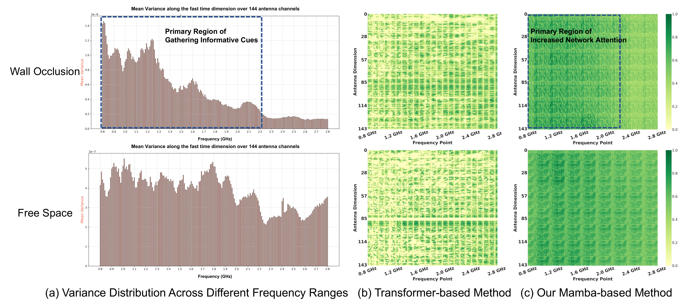
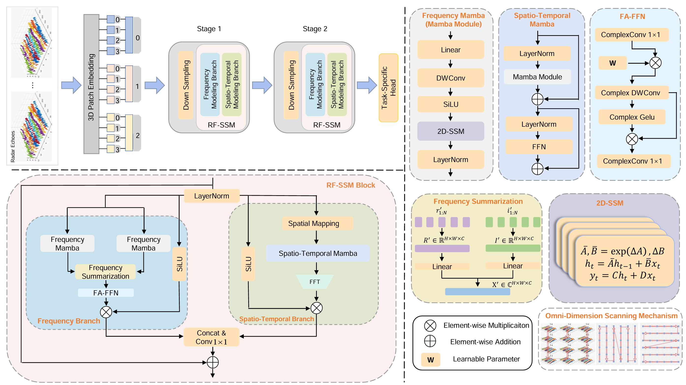

# RFMamba: Frequency-Aware State Space Model for RF-Based Human-Centric Perception


## Code repository for the paper: RFMamba: Frequency-Aware State Space Model for RF-Based Human-Centric Perception, ICLR 2025.

Authors: [Rui Zhang](ruizh@mail.ustc.edu.cn), , Ruixu Geng, Yadong Li, Ruiyuan Song, Hanqin Gong, Dongheng Zhang, Yang Hu, and [Yan Chen](https://ustc-ip-lab.github.io/authors/yanchen/)

Affiliation: [Intelligent Perception Lab](https://ustc-ip-lab.github.io/), University of Science and Technology of China. [Paper Link]([pdf](https://openreview.net/pdf?id=lG9fjBLb6d))

<div align=center>
    
</div>

## Introduction

- In this paper, we present RFMamba, the first state space model for RF-based human perception, demonstrating Mamba’s potential in efficient yet effective global modeling of long-sequence RF signals.
- This repository includes code for RFMamba.

<div align=center>
    
</div>


## How to Access the Code

The [USTC IP Lab](https://ustc-ip-lab.github.io/) has particular protocols for releasing the code and dataset. To access the code, please sign the [code agreement](IPLabCodeAgreementIFNet.pdf), scan and send it to ruizh@mail.ustc.edu.cn. A notification email that includes the code link will be sent within three days.

## Run Demo
### Requirements
```
pip3 install torch --index-url https://download.pytorch.org/whl/cu124
```
```
pip install cython
```
```
pip install torchbox numpy scipy dominate visdom
```
### Train and test
Set the dataset path in ./options/base_options.py, then run
```
python train.py
```
```
python test.py
```

## Citing
If you find this code useful for your research, please consider citing the following paper:
```
@inproceedings{
zhang2025rfmamba,
title={{RFM}amba: Frequency-Aware State Space Model for {RF}-Based Human-Centric Perception},
author={Rui Zhang and Ruixu Geng and Yadong Li and Ruiyuan Song and Hanqin Gong and Dongheng Zhang and Yang Hu and Yan Chen},
booktitle={The Thirteenth International Conference on Learning Representations},
year={2025},
url={https://openreview.net/forum?id=lG9fjBLb6d}
}
```
